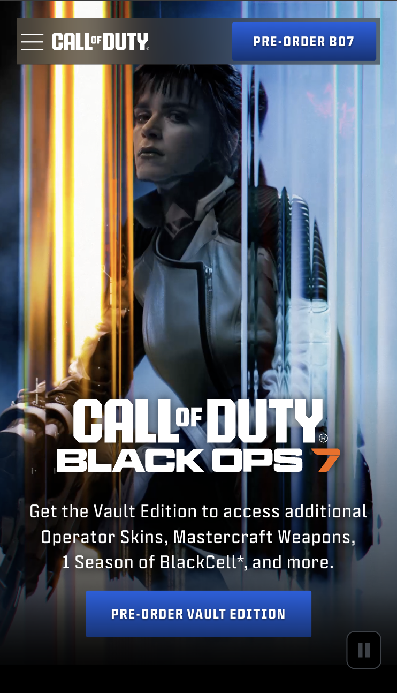
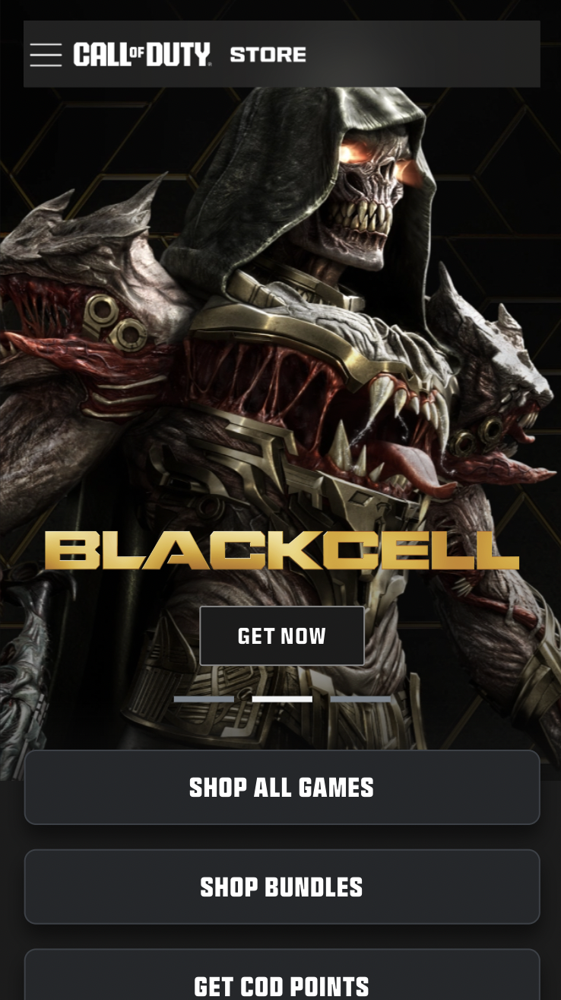

# Procesverslag
Markdown is een simpele manier om HTML te schrijven.  
Markdown cheat cheet: [Hulp bij het schrijven van Markdown](https://github.com/adam-p/markdown-here/wiki/Markdown-Cheatsheet).

Nb. De standaardstructuur en de spartaanse opmaak van de README.md zijn helemaal prima. Het gaat om de inhoud van je procesverslag. Besteedt de tijd voor pracht en praal aan je website.

Nb. Door *open* toe te voegen aan een *details* element kun je deze standaard open zetten. Fijn om dat steeds voor de relevante stuk(ken) te doen.

## Jij

  
uitwerken voor kick-off werkgroep

  ### Auteur:
  Daniël Vervaart

  #### Je startniveau:
  rood

  #### Je focus:
  Nu nog surface plane
 

## Je website

  
uitwerken voor kick-off werkgroep

  ### Je opdracht:
  link naar de website die je gaat namaken óf de naam/omschrijving van je eigen ontwerp
  https://www.callofduty.com/nl
  en
  https://www.honda.nl/motorcycles.html

  #### Screenshot(s) van de eerste pagina (small screen): 
  Home pagina 
  

  #### Screenshot(s) van de tweede pagina (small screen):
  Store pagina https://www.callofduty.com/nl/blackops7
  
 

## Toegankelijkheidstest 1/2 (week 1)

  
uitwerken na test in 2e werkgroep

  ### Bevindingen
  Lijst met je bevindingen die in de test naar voren kwamen:
 Vraag | Antwoord
--- | ---
Use plain language and avoid figures of speech, idioms, and complicated metaphors. | yes

Make sure that button, a (links), and label (in forms) content is unique and descriptive | No

Validate your HTML. | No

Use a lang attribute on the html element. | Yes

Provide a unique title for each page. | Yes

Ensure that viewport zoom is not disabled. | Yes

Make sure there is a visible focus style for interactive elements that are navigated (tab and shift + tab) to via keyboard input. | No

Check to see that keyboard focus order matches the visual layout.| No

Check that the site can be rotated to any orientation. | Yes

Remove horizontal scrolling. | Yes

Ensure that button and link icons can be activated with ease (size and position). | Yes

Ensure sufficient space between interactive items in order to provide a scroll area. | Yes

Use heading elements to introduce content. | Yes

Use only one h1 element per page or view. | No

Heading elements should be written in a logical sequence. | No

Don't skip heading levels. | No

Use list elements (ol, ul, and dl elements) for list content. | Yes

Make sure that all img elements have an alt attribute. | No

Make sure that decorative images use null alt (empty) attribute values. | Yes

Provide a text alternative for complex images such as charts, graphs, and maps. | No

For images containing text, make sure the alt description includes the image's text.| Yes

**Media** |   .

Make sure that media does not autoplay. | No

Check to see that all media can be paused. | Yes

Video – Confirm the presence of captions. | Yes

Audio – Confirm that transcripts are available. |Yes

**Controls** |  .

Use the a element for links. | Yes

Ensure that links are recognizable as links. | Yes

Ensure that controls have :focus states. | Yes

Use the button element for buttons. | No

Provide a skip link and make sure that it is visible when focused. | Yes

Identify links that open in a new tab or window. | Yes

**Appearance** | .

Check if dark and light mode are supported. | No

Check if high-contrast mode is supported. | No

Increase text size to 200%. | Yes

Make sure color isn't the only way information is conveyed. | Yes

**Animation** | .
Ensure animations are subtle and do not flash too much. | No

Provide a mechanism to pause background video. | Yes

Make sure all animation obeys the prefers-reducedmotion media query. | Yes

**Color** | **Contrast**

Check the contrast for all normal-sized text. | Yes

Check the contrast for all large-sized text. | Yes

Check the contrast for all icons. | Yes

Check text that overlaps images or video. | Yes

Check custom ::selection colors. | Yes

## Breakdownschets (week 1)

  
uitwerken na afloop 3e werkgroep

  ### de hele pagina: 
  

  ### dynamisch deel (bijv menu): 
  

  ### wellicht nog een dynamisch deel (bijv filter): 
  

## Voortgang 1 (week 2)

  
uitwerken voor 1e voortgang

  ### Stand van zaken
  De code lijkt goed te gaan, maar mijn hamburger menu's lijken een soort schrodeniers box. Ene keer werken ze andere keer verdwijnen ze uit het niets.

  De video en de fonts heb ik gedownload, maar krijg ik nog niet goed in de website. Ik heb een begin, maar moet nog wel alles een beetje op frissen en verbeteren. De nav heb ik voor nu sticky gemaakt, maar moet ik nog uit beeld laten gaan als ik weg scroll.

  ### Agenda voor meeting
  samen met je groepje opstellen

  | Jada     | student 2          | student 3    | student 4        |
  | ---            | ---                | ---          | ---              |
  | tekst naar links  | en dit             | en ik dit    | en dan ik dat    |
  | trekken bespreken, | dit als er tijd is | nog een punt | dit wil ik zeker |
  | svg vinden voor een pijl | ...                | ...          | ...              |
  |Order van de H'tjes aanpassen|    |    |    |

  ### Verslag van meeting
  hier na afloop snel de uitkomsten van de meeting vastleggen

  - punt 1
  - punt 2
  - nog een punt
  - ...

## Voortgang 2 (week 3)

  
uitwerken voor 2e voortgang

  ### Stand van zaken
  hier dit ging goed & dit was lastig (neem ook screenshots op van delen van je website en code)

  ### Agenda voor meeting
  samen met je groepje opstellen

  | student 1      | student 2          | student 3    | student 4        |
  | ---            | ---                | ---          | ---              |
  | dit bespreken  | en dit             | en ik dit    | en dan ik dat    |
  | en dat ook nog | dit als er tijd is | nog een punt | dit wil ik zeker |
  | ...            | ...                | ...          | ...              |

  ### Verslag van meeting
  hier na afloop snel de uitkomsten van de meeting vastleggen

  - punt 1
  - punt 2
  - nog een punt
- ...

## Toegankelijkheidstest 2/2 (week 4)

  
uitwerken na test in 9e werkgroep

  ### Bevindingen
  Lijst met je bevindingen die in de test naar voren kwamen (geef ook aan wat er verbeterd is):

## Voortgang 3 (week 4)

  
uitwerken voor 3e voortgang

  ### Stand van zaken
  hier dit ging goed & dit was lastig (neem ook screenshots op van delen van je website en code)

  ### Agenda voor meeting
  samen met je groepje opstellen

  | student 1      | student 2          | student 3    | student 4        |
  | ---            | ---                | ---          | ---              |
  | dit bespreken  | en dit             | en ik dit    | en dan ik dat    |
  | en dat ook nog | dit als er tijd is | nog een punt | dit wil ik zeker |
  | ...            | ...                | ...          | ...              |

  ### Verslag van meeting
  hier na afloop snel de uitkomsten van de meeting vastleggen

  - punt 1
  - punt 2
  - nog een punt
  - ...

## Eindgesprek (week 5)

  
uitwerken voor eindgesprek

  ### Je uitkomst - karakteristiek screenshots:
  

  ### Dit ging goed/Heb ik geleerd: 
  Korte omschrijving met plaatjes

  

  ### Dit was lastig/Is niet gelukt:
  Korte omschrijving met plaatjes

  

## Bronnenlijst

  
continu bijhouden terwijl je werkt

  Nb. Wees specifiek ('css-tricks' als bron is bijv. niet specifiek genoeg). 
  Nb. ChatGpT en andere AI horen er ook bij.
  Nb. Vermeld de bronnen ook in je code.

  1. [bron 1](https://www.w3schools.com/howto/howto_css_fullscreen_video.asp)
  2. bron 2
  3. ...

